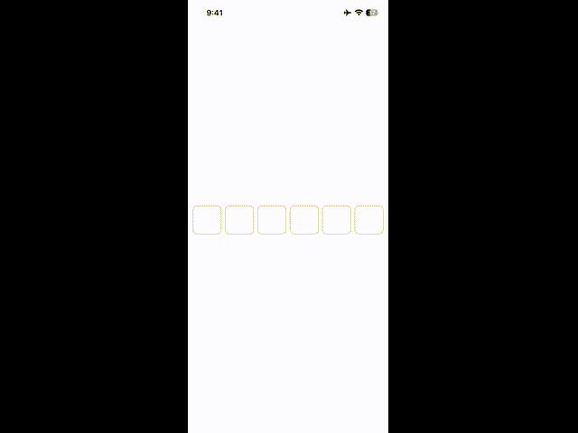

# SwiftUIOTPEntry

**SwiftUIOTPEntry** is a lightweight and customizable SwiftUI component for entering OTP (One-Time Password) or PIN-style codes. Designed for simplicity and full compatibility with **iOS 17+**.

---



## 🚀 Features

- 📱 Built with SwiftUI
- 🔢 Supports variable code lengths (default: 6 digits)
- 🎨 Easy customization of colors, borders, and behavior
- 🔐 Ideal for OTP and authentication flows

---

## 📦 Installation

You can integrate **SwiftUIOTPEntry** using **Swift Package Manager**.

### Xcode

1. Go to `File > Add Packages...`
2. Enter the repository URL:
   ```
   https://github.com/julioarregoitia/SwiftUIOTPEntry.git
   ```
3. Choose the desired version and add the package to your target.

### Using `Package.swift`

```swift
dependencies: [
    .package(url: "https://github.com/julioarregoitia/SwiftUIOTPEntry.git", from: "1.0.0")
]
```

Then include it in your target:

```swift
.target(
    name: "YourApp",
    dependencies: ["SwiftUIOTPEntry"]
)
```

---

## 🧪 Basic Usage

```swift

import SwiftUI
import SwiftUIOTPEntry

struct ContentView: View {
    
    let model: ModelUISwiftUIOTPEntry = .init(font: .systemFont(ofSize: 20),
                                              count: 6,
                                              spacing: 8,
                                              colorFocused: .red,
                                              colorEmpty: .gray,
                                              colorFill: .green, 
                                              size: 55)
        
        
    @State var number: String = ""
    
    /// `Bool for dismiss the keyboard
    @State var isDismissKeyboard: Bool = false
    
    var body: some View {
        ZStack {
            Color.white.onTapGesture {
                isDismissKeyboard = true
            }
            
            ViewSwiftUIOTPEntry(model: model, number: $number, isDismissKeyboard: $isDismissKeyboard)
        }
    }
}

#Preview {
    ContentView()
}
```

---

## ⚙️ Customization

> You can customize the components with the next propierties that shows below:

```swift
struct ModelUISwiftUIOTPEntry {
    /// `Font of each number in the row`
    let font: UIFont
    
    /// `The number of square boxes to fill with numbers`
    let count: Int
    
    /// `The space in horizontal between each square box`
    let spacing: CGFloat
    
    /// `The color of the border of the square when an item is focused`
    let colorFocused: Color
    
    /// `The color of the border of the square when an item is not focused and also NOT filled with a number`
    let colorEmpty: Color

    /// `The color of the border of the square when an item is not focused and also IS filled with a number`
    let colorFill: Color
    
    /// `The size of each square box (take into account that each box is a square)`
    let size: CGFloat
}
```

---

## 📱 Requirements

- iOS 17.0+
- Swift 6.2+
- SwiftUI

---

## 📄 License

This project is released under the MIT License.  
See the `LICENSE` file for more information.

---

## ✨ Contributions

Contributions are welcome!  
Feel free to open issues, suggest features, or submit pull requests.
